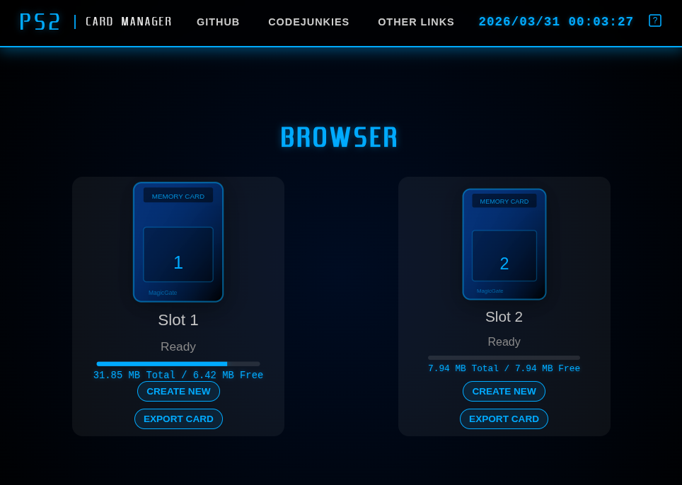

# PS2 Card Manager (mymc_web)
[Try it now](https://bad-al.github.io/mymc_web/)

A retro-styled web interface for managing PlayStation 2 memory card images (`.ps2`) for PCSX2. This tool allows you to easily browse, import, export, and transfer saves between cards directly in your browser.

mymc was originally ported to [dart_mymc](https://github.com/BAD-AL/dart_mymc) for use in the [NFL2K5Tool_web](https://bad-al.github.io/nfl2k5tool_web/) gamesave editor and I thought it would be cool to add a web interface for easier card management.
You can still obtain the original mymc [python code here](https://github.com/ps2dev/mymc).

## 🎮 For Users

### Features
- **Manage Cards**: Create new blank cards (8MB to 64MB) or load your existing `.ps2` images.
- **Save Management**: Import saves (`.max`, `.psu`) or export them to various formats.
- **Dual Slot Support**: Load two cards at once to quickly copy saves between them.
- **Hosted Library**: Access a curated collection of save packs directly from our server.
- **No Installation**: Runs entirely in your web browser—no software to install.


### How to Use
1. **Load a Card**: Click on **Slot 1** or **Slot 2** and select "Load from Computer" to pick your `.ps2` file, or simply drag and drop the file onto the slot.
2. **Browse**: Once a card is loaded, click the slot to see all saves currently on the card.
3. **Copy Saves**: With cards loaded in both slots, click a save in one slot and choose "Copy to Slot X" to transfer it to the other card.
4. **Importing**: Drag and drop `.zip`, `.max` or `.psu` save files onto a card to add them.
5. **Exporting**: Click "Export Card" on the main screen to download your card as a `.ps2` image or a `.zip` archive of all its contents.

### Navigation
- **Keyboard**: Use Arrow keys to navigate, Enter to select, and Backspace/Esc to go back.
~~-  **Controller**: Support for standard gamepads is included for a true console experience.~~

---

## 🛠 For Developers

This project is built using **Dart** and the **dart_mymc** library. It is designed as a single-page application (SPA) with no external UI frameworks, utilizing raw HTML/CSS and the Canvas API for the 3D background.

### Tech Stack
- **Language**: Dart
- **Library**: [dart_mymc](https://github.com/BAD-AL/dart_mymc) (Git dependency)
- **Frontend**: Vanilla HTML5, CSS3, and `package:web`.
- **Icons/Fonts**: Custom SVG generation and `EmotionEngine` TTF font.

The Dart language was chosen for it's ability to compile to native, wasm, JavaScript and it's modern feel.

### Getting Started
1. **Prerequisites**: Install the [Dart SDK](https://dart.dev/get-dart).
2. **Setup**:
   ```bash
   dart pub get
   ```
3. **Run (Development)**:
   ```bash
   webdev serve
   
   or to debug with chrome:
   webdev serve --debug 
   ```
4. **Build (Production)**:
   ```bash
   webdev build
   ```

#### Special Thanks to
1. Ross Ridge for mymc (python)
2. caol64 for the Icon rendering logic [ps2mc-browser](https://github.com/caol64/ps2mc-browser)